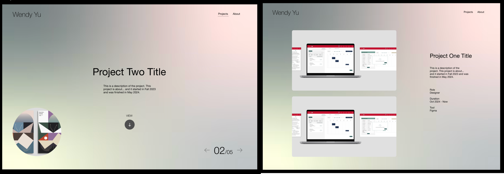
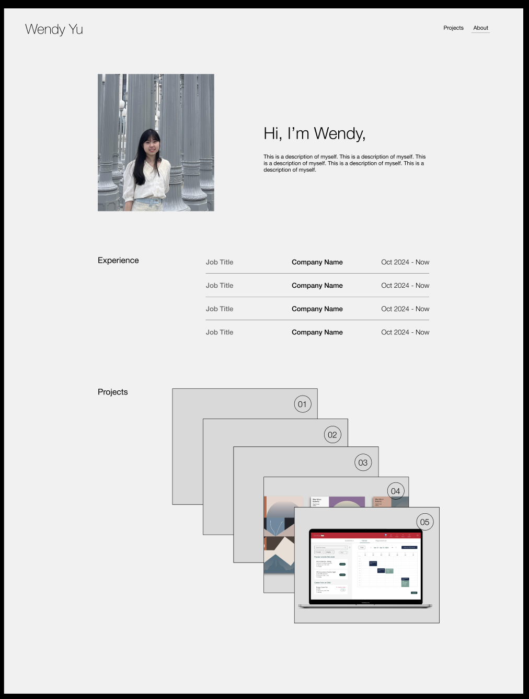
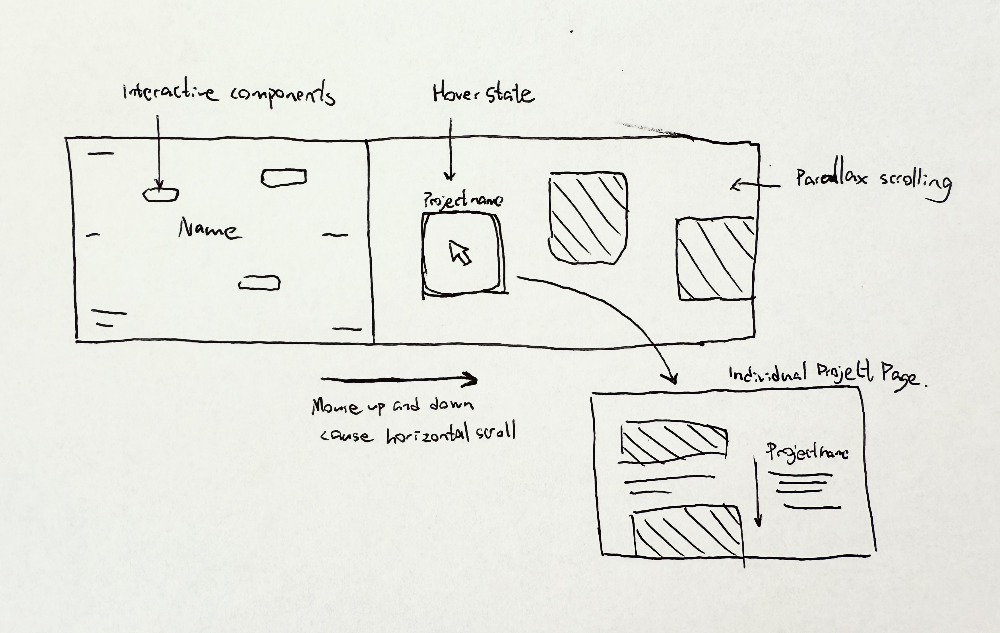
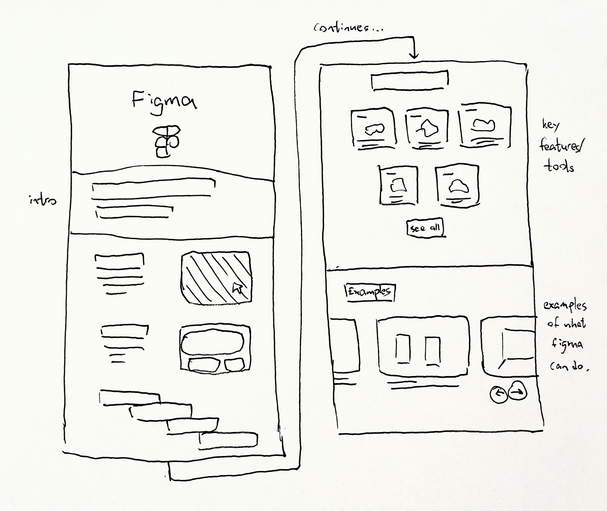

# FP4 - Final Project Writeup

# **FP2 \- Evaluation of the Final project**

## Project Description

My motivation for this project is to create a clear, engaging portfolio website that effectively showcases my design work and personal profile. This website will use a vertical scroll format. The goal is to offer potential collaborators and employers an easy and interesting way to explore my work and learn more about my background and skills.

## High-Fi Prototypes

### *Prototype 1*

The left image is the landing page, which showcases a brief of each project. The users interacts by scrolling on the trackpad, which switch to the next or previous project. The right image shows a project detail page, once the user clicks "read". 

User feedback: There is a lack of clear signifiers or affordances for exiting a project. Additionally, they expressed confusion about how to interact with the project pages, whether to use arrows, scroll, or another method to navigate through projects. 

### *Prototype 2*

This prototype shows my profile page. It outlines my experiences and provides a place to look at all the projects I've done. 

User feedback: For the profile page, participants recommended adding more interactive elements to enhance engagement and make the content more dynamic. 

## Usability Test

I conducted my usability test with 2 participants, who were asked to perform tasks such as exploring projects, delving into a specific project, and finding my profile, while using a think-aloud approach to share their thoughts.

In summary, the feedback I received during the usability test highlighted a few key areas for improvement: the lack of affordances for exiting individual project pages, confusion over how to interact with the project pages, and the need for more interactive elements on the profile page. To address these points, I first added a "scroll" indicator on the side of the project pages to inform users that they can scroll to explore additional content. I also included a "back" icon on the project detail pages, making it clear how to exit a project and return to the main gallery.

For the profile page, I incorporated more interactive hover effects to make the experience more engaging. In the Experience section, for instance, hovering over each role reveals specific tasks, allowing users to discover detailed information intuitively. 

## Updated Designs

In the project page and project detail page, "scroll" indicator and "back" icon were added. In the profile page, two hovering effects were added: the hovering effect for Experience section reveals more information, and the hovering effect for Projects section allows one project card to come to the front while fading out other cards.

## Feedback Summary

The feedback I got from group evaluation are as below:
- the website jumps directly into the project section without a personal introduction, making it feel less welcoming?
- Add more personal elements (an introduction, more interaction, etc)
- Think about another way to layout the projects in profile page
- “Scroll” visual hint is hard to see
- In the profile page, grey and black interface doesn’t create a lot of contrast - maybe experiment with color shades like you have on project title page

To address these points, I might add an introductory section labeled "00/05" on the project page to offer visitors a quick overview of who I am. The feedback on revising the layout for the projects in the profile page may not significantly influence my design, as I’m interested in experimenting with stacking cards. However, I plan to increase the spacing to reveal more of each card. I will also refine the scroll visual hint to make it more prominent, ensuring users recognize how to navigate. Lastly, I may incorporate a gradient effect into the profile page to create a more cohesive look.

## Milestones

Outline weekly milestones to plan your expected implementation progress until the end of the semester (\~300 words). 

### *Implementation Plan*

- [X] Week 9 Oct 28 \- Nov 1:
  - [X] FP1 due
  - [X] Finish FP2 Writeup
  
- [ ] Week 10 Nov 4 \- Nov 8:   
  - [ ] FP2 due
  - [ ] Basic HTML/css structure for the Project Page
  - [ ] Implement gradient animation background
  - [ ] Explore page transition using scrolling

- [ ] Week 11 Nov 11 \- Nov 15: 
  - [ ] Implement HTML/css for all pages (project detail pages + profile page)
  - [ ] Connect each Project Page with their specific project detail page
  - [ ] FP3 check-in
- [ ] Week 12 Nov 18 \- Nov 22:   
  - [ ] Implement JS for all pages
- [ ] Week 13 Nov 25 \- Nov 29: 
  - [ ] Use GSAP to add animation
  - [ ] Thanksgiving  
- [ ] Week 14 Dec 2 \- Dec 6:  
  - [ ] FP4 due 

### *Libraries and Other Components*

List the JS libraries and other components (if applicable) that you plan to use. 
* GSAP
* Motion One
* An animated gradient background library

## Generative AI Use Plan

Outline how you plan to use Generative AI tools to aid in the implementation (\~300 words).

### *Tool Use*

 What would you use? Edit the list given your plan. For each tool, explain briefly on what do you expect Generative AI to help you with and what might it not be able to help you with.

* ChatGPT  
  * I plan to use ChatGPT to help troubleshoot JavaScript issues, help in my debugging process, and explain unfamiliar concepts or libraries. ChatGPT’s ability to quickly generate, modify, and explain code snippets can save me time, especially during debugging or when exploring complex design approaches. 
  * I will not rely on ChatGPT for general coding; I will do all coding manually because this approach allows me to build a deeper understanding of the code and strengthens my skills. Coding manually also allows me to better understand potential issues and how to troubleshoot them, as I am directly engaged with every line of code. So I will avoid relying on it for direct code generation and copy pasting.
* GitHub Copilot  
  * I will not use GitHub Copilot because I don't have it.

### *Responsible Use*

How would you use Generative AI responsibly? 

To use Generative AI responsibly, I will verify and understand all generated code, making sure that it functions as expected and meets my project’s specific requirements. I’ll check AI-generated content very carefully, fact-checking any explanations or suggestions it provides to avoid misinformation. I’ll use these tools as assistants rather than as sole sources of truth. Additionally, I’ll document any places where I use Generative AI in my code comments.

---

# FP1 - Proposal for Critique

## Idea 1

The idea was to create a personal website to showcase my experiences, skills, and projects. It will be an interactive portfolio that presents my work in a clean and intuitive vertical scroll format. 

Design: The page starts with a bio and my image, then moves on to my experiences. Lastly, the projects will be displayed as a stack of cards. The users can click to enter the specific project page.

Motivation: This portfolio aims to provide potential employers or collaborators with a quick, accessible way to understand my experience and skillsets. The simplicity of a vertical scroll format allows visitors to explore my work intuitively and without distractions.

Interactivity and Engagement: To make the design engaging, I plan to use subtle animations and transitions to guide the user’s attention. For instance, when scrolling, project descriptions and visuals will smoothly animate into view. I also plan to use many hover effects. The library I will look into for this idea are GSAP and Motion One. 

Accessibility: I will ensure accessibility by adhering to WCAG guidelines, focusing on contrast and readable font sizes. 

Information to Convey: The website will include a biography, my experiences, my design projects, contact information.

Design Concerns:
How can I add engaging interactivity to a basic personal website?

## Idea 2 

This portfolio will showcase my design work in a horizontal scrolling format, simulating a digital gallery experience.

Motivation: The motivation behind this design is to create a unique, immersive browsing experience that sets my portfolio apart from typical vertical scroll websites. This layout better showcases visual-heavy projects and invites the user to explore the portfolio as they would in a real-world gallery.

Interactivity and Engagement: To enhance interactivity, the site will feature parallax scrolling, where background elements move at different speeds, creating depth. Projects will be represented as "cards," with each card expanding to full-screen mode upon click to reveal more details and interactive content. I will also add hover effects and smooth transitions.

Accessibility: I’ll make this design accessible by providing signals on how to scroll. I need to consider how to make this compatible on mobile experience. 

Information to Convey: This portfolio will include an introductory section about me, followed by a gallery of design projects. 

Design Concerns:
- How can I ensure that users understand the horizontal scroll mechanic intuitively?
- How can I optimize the horizontal scrolling mechanism for both desktop and mobile users, ensuring a smooth experience across devices and screen sizes?

## Idea 3

Basic Idea: FigmaStart is an interactive tool designed to teach beginners how to use some key features of Figma. 

Motivation: The motivation behind this tool is to create a more practical and engaging learning experience compared to Figma’s official resources, which can feel overwhelming for beginners.

Interactivity and Engagement: The tool will feature many animations that use GSAP and Motion One.

Accessibility: I will ensure accessibility by adhering to WCAG guidelines, focusing on contrast and readable font sizes. 

Information to Convey: FigmaStart will focus on teaching the core features of Figma, targeting beginners. 

Design Concerns: 
- How can I present key information in a clearer and more interactive way than Figma official resources page?
- How should I integrate visual aids, animations, or interactive elements to help users retain information effectively?

## Critiques Received
During the lab session, several important critiques were raised that will help refine the direction of my project. A key point was to consider the scope of my project and whether it is feasible given the limited time frame. I leanred that there is the need to define a Minimum Viable Product (MVP). It was suggested that I prioritize necessary features over “nice to have” features to ensure I accomplish a fully functional and polished outcome within the deadline.

Accessibility was another major theme. I was reminded to ensure my designs are accessible to a wide audience, paying attention to design elements such as color contrast, readability, and support for screen readers or keyboard navigation. 
I also received feedback on adding clear signifiers for the scrolling mechanism (especially horizontal scrolling), in order to ensure users intuitively understand how to navigate the site without confusion.

One suggestion was to check out Camille Mormal’s website as a reference for horizontally scrolling website. 

Regarding the portfolio structure, there was feedback around determining whether my projects should be placed in a horizontal or vertical scroll format depending on their content. Some projects might naturally lend themselves to one format over the other based on their visual and narrative flow.

Another feedback was to clarify whether my FigmaStart tool should target beginners or advanced users. This is crucial, as it will dictate the complexity of features I plan to include in the tool. Defining the target audience clearly will also help the users in understanding this website.

Finally, I received more creative ideas, such as placing projects in an infinite space where users could navigate in any direction, not only just horizontally or just vertically. 

## Reflection
Based on the feedback I received during the lab session, I’ve decided to move forward with the first idea: a personal website in a vertical scroll format. This idea is not only something I’m passionate about, but it also has an approachable scope that I can realistically complete in the two-month timeframe. Additionally, the general consensus from the feedback was that this option works best in terms of clarity and usability.

One critique I will act on is the suggestion to focus on creating a MVP. By narrowing down my priorities to the essential features, I can ensure that the website is functional by the deadline. For the next step, I will plan out the MVP I want my basic website to have. 

I will also incorporate the feedback around accessibility and affordance/signifiers for the scrolling mechanism. Since this design follows a simple vertical scroll, I will need to make sure it is not too basic by adding interactive elements that guide the user without overwhelming them. To address accessibility, I will ensure proper contrast, readable fonts, and make the site easily navigable with a keyboard or screen reader. 

However, I will not pursue more complex ideas like the infinite space navigation or horizontal scrolling at this stage. While these ideas are creative and intriguing, they are not really in the approachable scope I want to maintain for this project. Additionally, I think that a vertical scroll is more suitable for presenting my projects clearly and effectively for future usages.

Finally, I will make decisions about the content I want to include, focusing on key projects that best showcase my design process and skills, and avoid overloading the portfolio with excessive details.